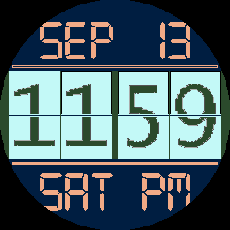
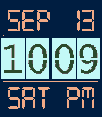
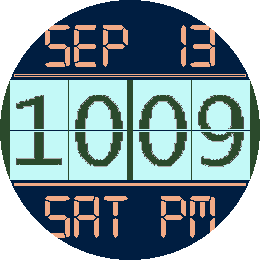
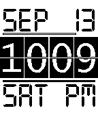

# Big Flip Clock

Big Flip Clock is a configurable Pebble watchface inspired by mechanical split-flap displays. Large bitmap digits animate at each minute change, with the date, day of week, battery level, and Bluetooth status arranged around the clock.

<p align="center">
  
</p>

## Features

- Mechanical-style animated digit flips
- Automatic 12-hour or 24-hour display based on the watch setting
- AM/PM indicator in 12-hour mode
- Date and localized day-of-week display
- Optional battery bar above the time
- Optional Bluetooth status alert with a connection bar below the time
- Configurable placement of the date and day of week
- Persistent color and display settings
- Layouts and digit artwork sized for rectangular and round displays

## Supported platforms

The current build targets all seven Pebble SDK platforms:

| Platform | Display | Color |
| --- | --- | --- |
| Aplite | 144 × 168 | Monochrome |
| Basalt | 144 × 168 | Color |
| Chalk | 180 × 180, round | Color |
| Diorite | 144 × 168 | Monochrome |
| Emery | 200 × 228 | Color |
| Flint | 144 × 168 | Monochrome |
| Gabbro | 260 × 260, round | Color |

| Emery | Gabbro | Aplite |
| :---: | :---: | :---: |
|  |  |  |

## Configuration

The settings page uses [Clay](https://github.com/pebble/clay) and provides controls for:

- Background color
- Time background color
- Time color
- Date and indicator color
- Battery bar visibility
- Date/day-of-week order
- Bluetooth status alerts

Color watches use the full Pebble palette. On monochrome platforms, the background and date/indicator colors are limited to black and white; the 1-bit digit tiles retain their native white-on-black artwork.

The Bluetooth bar appears while the alert is enabled and the watch is connected. A connection-state change also triggers a double vibration. Saved options use persistent storage and survive app restarts and upgrades from earlier releases.

## Building

Install the current Rebble Pebble SDK and Node.js, then run:

```sh
npm install
pebble build
```

The packaged watchface is written to `build/BIG_FLIP_CLOCK.pbw`. To install it in an emulator, select any supported platform:

```sh
pebble install --emulator basalt
```

## App Store assets

The [`appstore`](appstore/) directory contains current promotional media for every platform. All captures use 12-hour mode with the PM indicator visible.

- Color platforms include four static color combinations and one 11:59-to-12:00 animated GIF.
- Monochrome platforms include two opposite high-contrast static combinations and one black-background animated GIF.

## Credits

Big Flip Clock incorporates bitmap scaling code adapted from [pebble-gbitmap-lib](https://github.com/gregoiresage/pebble-gbitmap-lib) and palette-handling code from [GBitmap-Colour-Palette-Manipulator](https://github.com/rebootsramblings/GBitmap-Colour-Palette-Manipulator).

## License

Released under the [MIT License](LICENSE).
